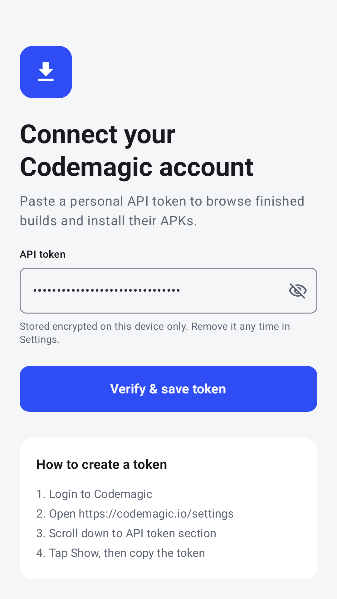
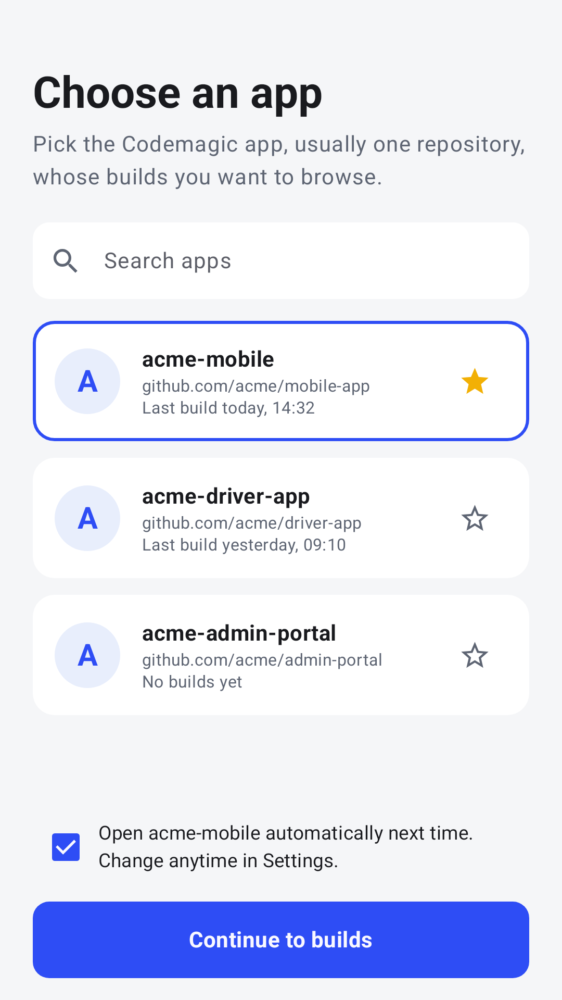
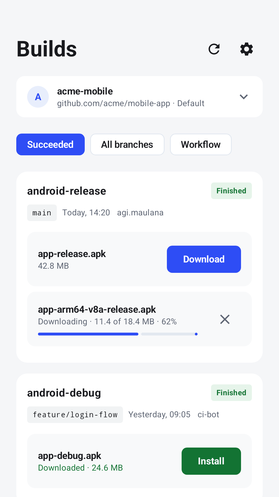
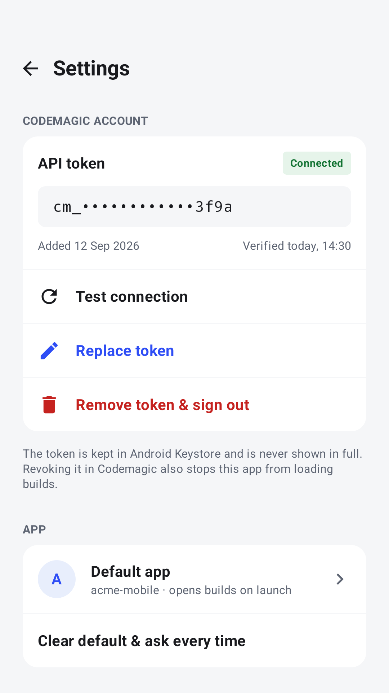

# Codemagic Connect (Unofficial)

A powerful, unofficial Android client for [Codemagic CI/CD](https://codemagic.io/). This application allows users to securely log in via their Codemagic API token, browse their applications and builds, and directly install APK artifacts to their Android devices.

## Features

* **Secure Login**: Authenticate securely using your Codemagic Personal Access Token.
* **App Dashboard**: Browse all your Codemagic applications.
* **Build History**: View build histories, statuses (success, failed, building, etc.), and details for each application.
* **Artifact Management**: Download and install APK artifacts directly from your build pipeline to your device.
* **Settings**: Manage application preferences.

## Screenshots

| Connect | Apps | Builds | Settings |
|:---:|:---:|:---:|:---:|
|  |  |  |  |

## Tech Stack & Libraries

* **UI**: [Jetpack Compose](https://developer.android.com/jetpack/compose) for a modern, declarative UI.
* **Architecture**: Clean Architecture + MVVM/MVI hybrid.
* **Dependency Injection**: [Dagger Hilt](https://dagger.dev/hilt/).
* **Concurrency**: [Kotlin Coroutines](https://kotlinlang.org/docs/coroutines-overview.html) & [Flows](https://kotlinlang.org/docs/flow.html).
* **Navigation**: [Jetpack Compose Navigation](https://developer.android.com/jetpack/compose/nav-adaptive).
* **Network**: [Retrofit](https://square.github.io/retrofit/) & [OkHttp](https://square.github.io/okhttp/) (via the `:data` module).
* **Testing**: JUnit4, [Turbine](https://github.com/cashapp/turbine) (for Flow testing), custom Coroutine Dispatcher rules.

## Project Structure & Architecture

This project strictly adheres to **Clean Architecture** principles, modularized by layer to enforce separation of concerns:

* `:app` - The main application module containing the UI layer (Compose UI, ViewModels, Navigation) and DI setup.
* `:domain` - The enterprise business logic layer. Contains use cases, domain models, and repository interfaces. **Has no Android framework dependencies.**
* `:data` - The data sources layer. Contains network/local implementations of the domain repository interfaces.
* `:core` - Foundational utilities, base classes, and test rules shared across modules.

### UI Architecture (MVI Hybrid)

The UI layer follows a strict **Route-Screen** pattern:
* **Route**: A stateful Compose container. It initializes the `ViewModel`, collects state (`UiState`), handles navigation, and intercepts one-time events (`UiEvent`).
* **Screen**: A completely stateless, declarative Compose component. It only receives `UiState` and emits user interactions via callbacks.
* **ViewModel**: Exposes a reactive `UiState` and emits one-time `UiEvent`s. It processes user intents (defined as an `Action` sealed interface).

*Note: ViewModels never initialize data in their constructor. Data loading is explicitly triggered via an `init()` method called from a `LaunchedEffect` in the Route.*

## Development & Testing Rules

We enforce strict coding standards and a **TDD (Test-Driven Development)** workflow. For a complete guide to our architectural boundaries, testing philosophy, and coding conventions, please read the **[`AGENTS.md`](AGENTS.md)** file carefully before contributing.

### Key Rules
* **Strict TDD**: Write tests first (RED), make them pass (GREEN), then refactor. Implement top-down (UI -> Domain -> Data).
* **No Magic Numbers**: All constants must be defined in a `companion object` at the bottom of the class using `UPPER_SNAKE_CASE`.
* **Fail-Fast Coroutines**: Do not silently swallow exceptions. Handle them explicitly and map them to UI errors where appropriate.

## Getting Started

1. Clone the repository.
2. Open the project in **Android Studio**.
3. Build and run the `:app` module on an emulator or physical device.
4. *To login:* Generate a Personal Access Token from your Codemagic account settings and paste it into the app's Connect screen.

## License

This project is licensed under the MIT License - see the LICENSE file for details.